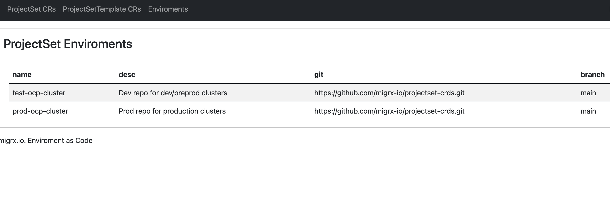

# Overview

**ProjectSet App** is an application that exposes an OpenAPI interface and UI, allowing users to create ProjectSet templates and ProjectSet instances. The application is integrated with identity providers like Active Directory (AD) and encapsulates state generation logic and integration with external services such as OpenAI and ServiceNow. Users can interact with the app directly using the UI and/or MS Teams/Slack bots that are integrated with the ProjectSet App using the API.


## Deployment

The application is deployed as a Kubernetes application and serves as the entry point for UI and API interactions. It can be deployed on one or more clusters for high availability.


## Persistence

Application is stateless and pull data from Git. It use temprorary local storage for temp data and cache only.


## Configuration

Application can be configured usign app.yaml file that stored as secret.

Example

```
envs:
  test-ocp-cluster:
    description: Dev repo for dev/preprod clusters
    url: https://github.com/migrx-io/projectset-crds.git
    branch: main
    token: <token>
    conf_file: projectsets.yaml
  prod-ocp-cluster:
    description: Prod repo for production clusters
    url: https://github.com/migrx-io/projectset-crds.git
    branch: main  
    token: <token>
    conf_file: projectsets.yaml

auth:
  ldap:
    url: "ldap://127.0.0.1:389"
    bindDN: "cn=admin,dc=example,dc=org"
    bindPW: <password>

    userSearch:
      baseDN: "ou=people,dc=example,dc=org"
      filter: "(objectclass=inetOrgPerson)"
      user_map:
        username: "mail"
        email: "mail"

    groupSearch:                                                            
      baseDN: "ou=groups,dc=example,dc=org"
      filter: "(objectClass=groupOfNames)"
      group_map:
        admins: "admin"
        developers: "user"

roles:
  user:
    (.*)/projectset/?$:
      - all
    (.*)/projectset/edit/:
      - annotations
      - labels
      - namespace
      - template
    (.*)/projectset/delete/:
      - all
    (.*)/projectset/create/?$:
      - annotations
      - labels
      - namespace
      - template
    (.*)/projectsettemplate/?$:
      - all
    (.*)/repo/?$:
      - all
    (.*)/logout/?$:
      - all

  admin:
    (.*)/projectset/?$:
      - all
    (.*)/projectset/edit/:
      - all
    (.*)/projectset/delete/:
      - all
    (.*)/projectset/create/?$:
      - all
    (.*)/repo/?$:
      - all
    (.*)/logout/?$:
      - all
    (.*)/repo/?$:
      - all
    (.*)/logout/?$:
      - all
    (.*)/projectsettemplate/?$:
      - all
    (.*)/projectsettemplate/edit/:
      - all
    (.*)/projectsettemplate/delete/:
      - all
    (.*)/projectsettemplate/create/?$:
      - all

```
- **envs**. Declare list of Git repo/Clusters to work with. See [Git repo structure](./git.md)

    `<token>` - access token to pull/push and create pull request

- **auth**. Authentication method (Active Directory). You need to provide the address to the Active Directory with an admin service account to read users and groups. Additionally, you should define search queries for users and groups and mapping to map Active Directory users and groups to cluster groups (this is needed for role binding).


- **roles**. RBAC application model for user access. You can define a role model to divide responsibility. For example, DevOps, who can create and manage templates, and Developers, who can only create instances from predefined templates without modifying them.

    Example, allow role edid ProjectSet for attributes - annotations, labels, namespace, template (all - all avaliable attributes)

        ```
        (.*)/projectset/edit/:
        - annotations
        - labels
        - namespace
        - template

        ```

### Environment variables

```
export JWT_SECRET_KEY=        # secret for JWT salt
export X_API_KEY=             # API key for service-service communication
export JWT_EXP=31536000
export JWT_HEADER="JWT"
export PWORKERS=1
export PWORKERS_SLEEP=15
export APP_CONF=./app.yaml 
export LOGLEVEL=INFO 

```

## OpenAPI (Swagger) 

!!swagger apispec_1.json!!

## UI

Login page


Enviroments page



ProjectSet page


ProjectSet Template page


