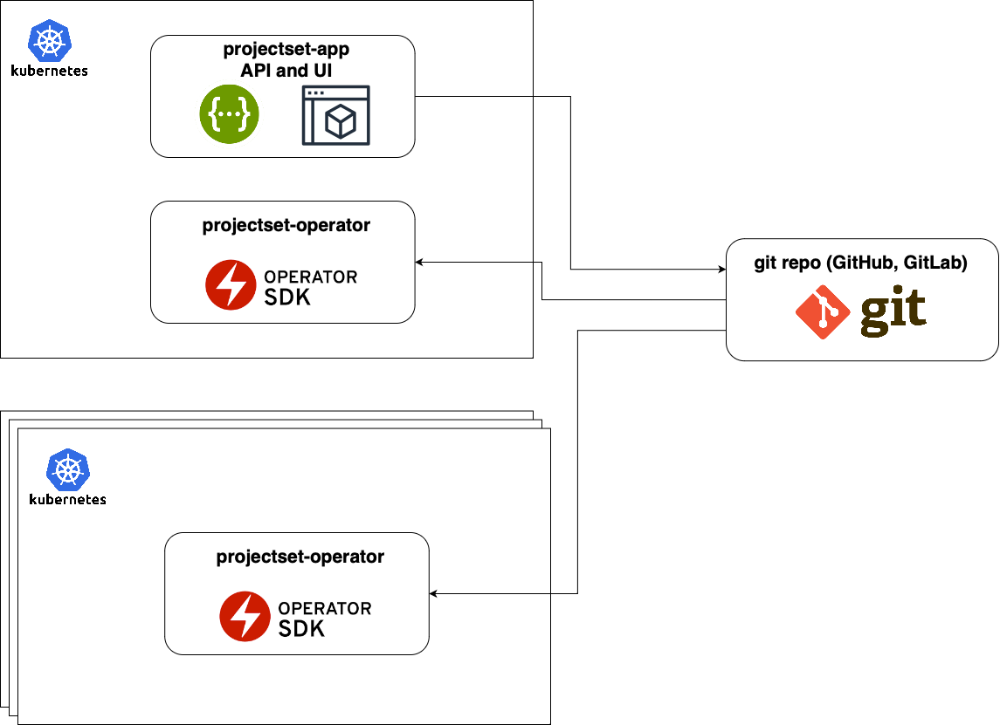

# Install

## Overview

The product include 3 main components that require installation and configuration:

1. **Git Repository**. You can use public services like GitHub or GitLab or use your own on-prem Git repo. You should have access to create a repo for CR-generated files and be able to generate a token to push, pull, and create pull requests.

2. **ProjectSet Operator**. This operator runs within your Kubernetes cluster as a deployment resource. It utilizes CustomResourceDefinitions to create and manage all resources with ProjectSet and ProjectSetTemplate custom resources. The ProjectSetSync custom resource is used to configure the source Git repo to sync state and push newly generated CRs, as well as create pull requests.

3. **ProjectSet App**. This application serves as an interface to the OpenAPI and UI, enabling users to create ProjectSet templates and instances. Deployed as a Kubernetes application, it acts as the entry point for UI and API interactions. It supports deployment on one or more clusters for high availability, ensuring reliability and scalability.

### Git Repository

1. Create new repo with env structure (see [example](./git.md))

2. Push empty structure and metadata (projectsets.yaml) to main/master branch

3. Create API token with push, pull, and Pull Request access (it will be stored as k8s secret later)

[Example repo](https://github.com/migrx-io/projectset-crds)

### ProjectSet Operator

You’ll need a Kubernetes cluster to run against. You can use [KIND](https://sigs.k8s.io/kind) to get a local cluster for testing, or run against a remote cluster.
**Note:** Your controller will automatically use the current context in your kubeconfig file (i.e. whatever cluster `kubectl cluster-info` shows).

1. Create operator namespace

        kubectl create ns projectset-operator-system

2. Create secret with GitHub/GitLab token (for ProsetSetSync to sync CRDs from git repo)

        kubectl create secret generic projectsetsync-secret \
            --namespace projectset-operator-system \
            --from-literal=token=<token>

3. Install Operator and all CRDs

        kubectl apply -f https://raw.githubusercontent.com/migrx-io/projectset-operator/main/config/manifests.yaml

4. Create ProjectSetSync configuration `projectsetsync.yaml`

    To start sync process from git you need to create CR.  See [example and details](/resources/#projectsetsync))

5. Apply ProsetSetSync to create sync resource on cluster

        kubectl apply -f projectsetsync.yaml

### ProjectSet App

*ProjectSet App can be installed in one cluster to manage all other clusters. Consider installing the ProjectSet App on more clusters only for high availability*

1. Create app namespace

        kubectl create ns projectset-app-system

2. Create app.yaml config

    Describe app configuration in `app.yaml` and define repos, auth and rbac. See [example and details](/app/#configuration))

3. Create secret with `app.yaml` for app

        kubectl create secret generic app-conf --from-file=app.yaml=app.yaml --namespace projectset-app-system

4. Install App

        kubectl apply -f https://raw.githubusercontent.com/migrx-io/projectset-app/main/deploy/manifests.yaml

5. Expose route 

        kubectl expose svc projectset-app-service -n projectset-app-system

## Video Guide how to install product

<iframe width="900" height="506" src="https://www.youtube.com/embed/lJ5iwvlds5M" frameborder="0" allow="accelerometer; autoplay; clipboard-write; encrypted-media; gyroscope; picture-in-picture; web-share" referrerpolicy="strict-origin-when-cross-origin" allowfullscreen></iframe>

## What's next

To get started, please view our [Guides](./ui_guide.md) 
