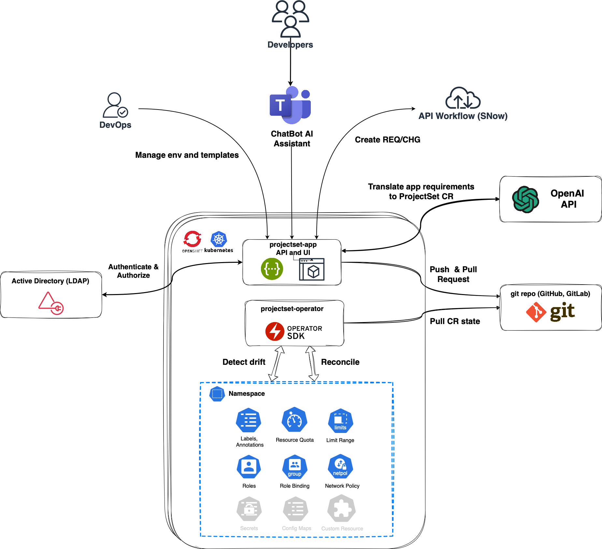

# projset.io

## Overview

**projset.io** GitOps & GptOps - driven scalable and consistent environments onboarding on Kubernetes and OpenShift

- **Git**. All environment definitions are stored in a Git repository and provide one point of truth for declared state. User workflow and approval mechanisms are built around Git Flow and use well-known practices like code review and pull requests to manage onboarding and changes for environments. 

- **ProjectSet Operator** extends Kubernetes with Custom Resources, which define the state of namespaces, labels, annotations, resource quotas, limit ranges, roles, role bindings, network policies, etc. It is responsible for synchronizing the state of resources that were defined and placed in Git. If the resource changes, the controller will reconcile the state in the cluster and update the it accordingly.

- **ProjectSet App** is an application that exposes an OpenAPI interface and UI, allowing users to create ProjectSet templates and ProjectSet instances. The application is integrated with identity providers like Active Directory (AD) and encapsulates state generation logic and integration with external services such as OpenAI and ServiceNow. Users can interact with the app directly using the UI and/or MS Teams/Slack bots that are integrated with the ProjectSet App using the API.

## Onboarding flow

1. DevOps teams may define a set of predefined templates for clusters. For example, these templates might include definitions of common riles and criteria such as size, network rules, or accepted roles with permissions, etc. Depending on requirements and needs, templates can be shared across clusters or be unique for each cluster.

2. Developers log in to the ProjectSet App or interact with the AI assistant through Teams/Slack to create ProjectSet custom resource definitions using templates and/or create them from scratch.

3. ProjectSet App generates custom resources and all dependencies based on user-provided answers and assistant AI recommendations. 

4. ProjectSet App creates a new branch with definition changes and creates a pull request to the main branch, providing details in comments. As part of that, it can create REQ/CHG requests in ServiceNow and start the approval workflow. 

5. Approvers review changes in Git and approve or deny the pull request. (ServiceNow workflow might include additional approval/validation logic if needed)

6. ProjectSet Operator observes the last merged changes in the main branch repository and syncs last state to cluster.

7. ProjectSet Operator reconciles Kubernetes resources, creating or changing them if needed. 

## Where to get started

To get started, please read through our Guides to get a jump start. See our getting started guide for installation instructions.

## How to get involved

This project is driven by its users and contributors, and we welcome everybody to get involved. Join us, open issues, or email support@projset.io. The success of this project depends on your input: No contribution is too small - even opinions matter!
